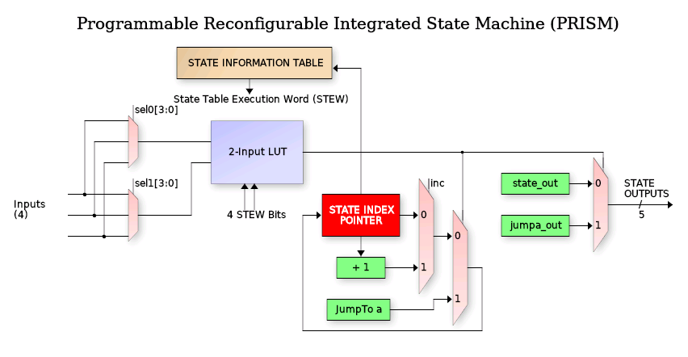
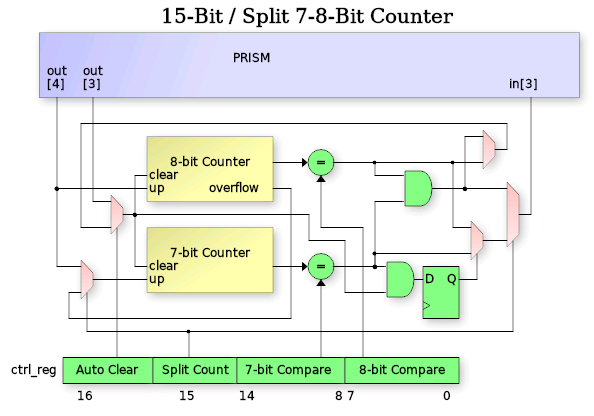

## How it works

This is a very simple Wokwi example that incorporaates two different designs.  

### Design 1 - 7-Seg Snake
The first design uses the 7-Segment display
to show a 3-segment "snake" as it moves around the display.  It uses three 3-bit registers to store the current location of the
"head", "body" and "tail", along with a register identifying the direction (0=clockwise, 1=counter clockwise).

There are two larger registers also, one a simple counter for speed control and the other a Linear Feedback Shift Register (LFSR)
to randomize the direction of travel.

### Design 2 - Mini PRISM
The second design is a small implementation of the Programmable Reconfigurable Indexed State Machine (PRISM).  This is a Verilog
programmable 8-state finite state machine that uses an 8-entry, 22 wide State Table Execution Word (STEW) to define state
transitions and output values based on current state and input values.  The PRISM includes a counter 

## How to test

Supply a 10 KHz clock.  Then set the speed using the ui_in[7:0] pins.  Larger binary values represent slower speed.  Start off 
with something like 8'h20 (i.e. ui_in[5] HIGH, the rest LOW).  Watch the snake move around.  Try different speeds.  

NOTE:  When changing from a slower to a faster speed, the initial update may take a few seconds.  This is because the 
This is because the counter may already be larger than the newly entered "speed" value, and therefore must count all the 
way up until it wraps to zero.  The speed compare is a simple EQUAL circuit and doesn't check for GREATER-THAN-OR-EQUAL.

## External hardware

Only need the 7-Segment display on the demo board.

## PRISM

PRISM (Programmable Reconfigurable Indexed State Machine) is a block that executes a Verilog-coded Mealy state machine loaded via a runtime loadable configuration bitstream generated by a custom branch of Yosys.
PRISM includes it's own counter and compare sub-peripheral for performing timing operation as well.

The PRISM controller block is a programmable state machine that uses an N-bit (3 in this case)
index register to track the current FSM state.  That index is a pointer into the State Information Table (SIT) to request the State Execution Word (STEW).

## What can it do?

## Operating priciples of PRISM

PRISM supports FSM designs up to 8 states and includes controllable peripherals such as counters,
communication shift register, FIFO and interrupt support.  It also features an integrated debugger
with 2 breakpoints, single-stepping and readback of state information.  Due to long combinatorial
delays, PRISM operates from a divide-by-two clock (32Mhz max).  The following is a block diagram
of the PRISM controller:

Each state is encoded with a 22-bit execution word that controls the
FSM output values, input values and state transition decision tree for that state.  The peripheral
is operated by loading a "Chroma" (more on that below), or execution personality in the 192 bit
configuration array as well as configuring the 3 bits of operational mode configurtaion.
The 3-bits of operational configuration include:

 - Debug output bit:  Sends internal state operations to uo_out[7:0]
 - Auto-clear bit:    Auto clears the counter when compare match occurs
 - Split-coiunter:    Splits the 15-bit conter into an 8-bit plus 7-bit each with individual compare.

Once a chroma has been loaded, the control register programmed and the PRISM enabled, the FSM
will start at state 0.  Eight of the bits in the State Execution Word (STEW) specify which of
16 inputs get routed to the 2-input Look Up Table (LUT) that makes the decision for jumping to
the specified state (stored in 3 bits of the STEW).  While in any state, there is a set of 11
(from the STEW) output bits that drive the PRISM block outputs when the LUT output is zero
(no jump) and 11 more that are output during a jump (transitional outputs).

Each state also has an independent 16-input mux (4-bits from STEW) driving a 1-input LUT to
drive a "conditional output".  This is an output who's value is not strictly depedent on the
static values in the STEW for the current state, but rather depends on the selected input during
that state.

### State Looping (important)

In larger PRISM implementations, each state has "dual-compare" with two N-bit LUTs which allows
jumping to one of two possible states.  Due to size restrictions, this peripheral does not include
dual-compare.  Instead the PRISM implementation has (in each state's STEW), a single
"increment state" bit.

In any state where the 'inc' bit is set and the LUT output is FALSE (i.e no jump),
then the state will increment to the next state, and the "starting state" of the first occurance
of this will be saved (i.e. start of loop).  Then each successive state can test a different set of
inputs to jump to different states.  When a state is encountered with the 'inc' bit NOT set, PRISM
will loop back to the "starting state" and loop through that set of states until the first TRUE
from a LUT causing a jump, clearing the loop.

### TL/DR
  1. Load a Chroma defining the FSM and enable PRISM.
  2. State starts at zero.
  3. Each state chooses up to 3 of 16 inputs via config bits.
  4. 2-input LUT decides if "jump to defined state" occurs.
  5. Increment bit decides if "state looping" is in effect.
  6. State looping ends when first LUT jump occurs.
  7. Outputs bits from STEW for "non-jump" and "transitional jump".
  8. One conditional output based on single selected input per state.

## External PRISM Inputs

Inputs to the PRISM engine come from the uio_in[2:0] pins of the TinyTapeout ASIC (in 2-0) as well as the
counter compare logic (in 3).  The in3 compare logic has special modes as follows:

  1. If not split-mode (i.e. 15-bit counter), in3 goes high when count[14:0] == compare.
  2. If split-mode counter, in3 goes high when the 7-bit count compare matches, then again when 8-bit count compare matches.

## External PRISM Outputs

The PRISM has 5 outputs, all of which are visible on uio_out[7:3]. Outputs [5] and [4] also have 
special internal functions as follows:

   out[5]: Counter increment
   out[4]: Counter clear (when not in auto-clear mode)

All outputs are registered via the main clock to prevent output glitching caused by combinatoril 
transitions during state decision switching.

## 15-Bit Counter

The 15-bit counter is an up/clear counter controllable from the PRISM chroma.

## Chroma

Chroma are PRISM's version of "personalities".  Each chroma is a unique hue of PRISM's
spectrum of behavior. Chroma's are coded as Mealy state machines in Verilog to define FSM
inputs, outputs and state transitions:

    always @(posedge clk or negedge rst_n)
       if (~rst_n)
          curr_state <= 3'h0;
       else
          curr_state <= fsm_enable ? next_state : 'h0;
 
    always_comb
    begin
       pin_out[5:0]   = 6'h0;
       count1_dec     = 1'b0;
       etc.
 
       case (curr_state)
       STATE_IDLE:       // State 0
          begin
             // Detect I/O shift start 
             if (host_in[HOST_START])
             begin
                // Load inputs 
                pin_out[GPIO_LOAD] = 1'b0;
 
                // Load 24-bit shift register from preload (our OUTPUTS)
                count1_load = 1'b1;
                next_state = STATE_LATCH_INPUTS;
             end
          end
       STATE_LATCH_INPUTS:  // State 1
          begin
             next_state = STATE_SHIFT_BITS;
          end
       etc.
    end

Chroma are compiled into PRISM programmable bitstreams via a custom fork of Yosys (see link below)
using a configuration file describing the PRISM architecture.  In addition
to bitstream generation, the Yosys PRISM backend also calculates the ctrl_reg value for 
configuring the PRISM peripheral muxes, etc.  There are several output formats including C,
Python and columnar list:

| ST | Mux0 | Mux1 | Inc | JmpA | OutA | Out | CfgA |   STEW |
|----|------|------|-----|------|------|-----|------|--------|
|  0 |    0 |    0 |   0 |    1 |   08 |  08 |    e | 039082 |
|  1 |    3 |    0 |   0 |    2 |   11 |  11 |    a | 0ea314 |
|  2 |    3 |    0 |   0 |    0 |   12 |  12 |    a | 0ea520 |
|  3 |    0 |    0 |   0 |    0 |   00 |  00 |    f | 03c000 |
|  4 |    0 |    0 |   0 |    0 |   00 |  00 |    f | 03c000 |
|  5 |    0 |    0 |   0 |    0 |   00 |  00 |    f | 03c000 |
|  6 |    0 |    0 |   0 |    0 |   00 |  00 |    f | 03c000 |
|  7 |    0 |    0 |   0 |    0 |   00 |  00 |    f | 03c000 |

The table has the following fields
 - ST: the state (obvious)
 - Mux0: Selects input for LUT2 input 0 (jump decision)
 - Mux1: Selects input for LUT2 input 1
 - Inc: Set when next state looping is requested (i.e. 'else state <= ST_A')
 - JmpA: The "Jump to" state if LUT2 output is TRUE
 - OutA: Outputs during "jump to" JmpA state (LSB is PRISM out[0])
 - Out: Output during no-jump, steady-state dwelling
 - CfgA: The LUT2 4-bit lookup table values
 - STEW: The complete word aggregrated in proper bit order

